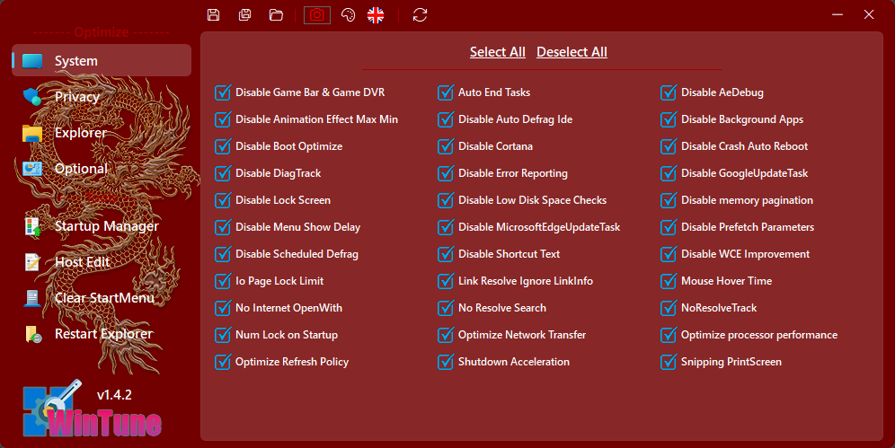
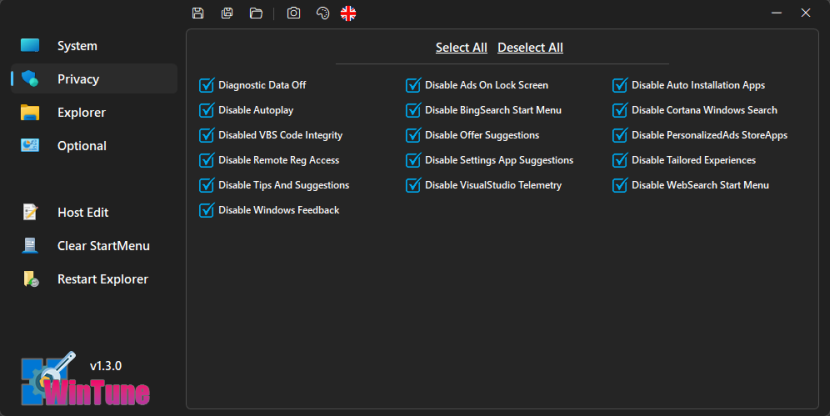
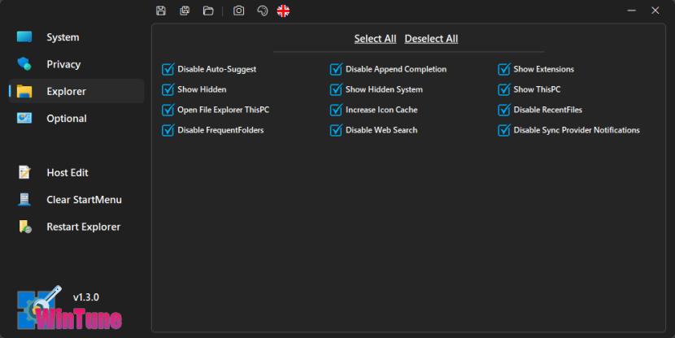
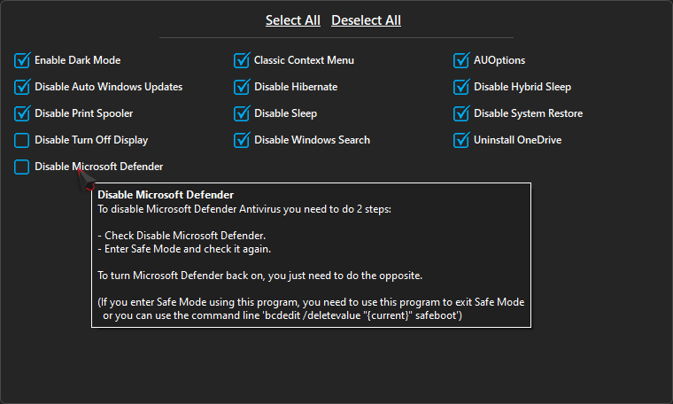

  

<h3 align=center>Tweak & optimize your Windows system</h3>
 

## Features

- System optimization:

	
- Privacy optimization:

 

- Optional optimization:

- Host edit

- Clear StartMenu

- There are tooltips describing functions for easier use

- Save/Load optimization configuration JSON file

## Compatibility

- Windows 10 or higher
- Windows Server 2016 or higher

## Requirements

- Administrator privileges
