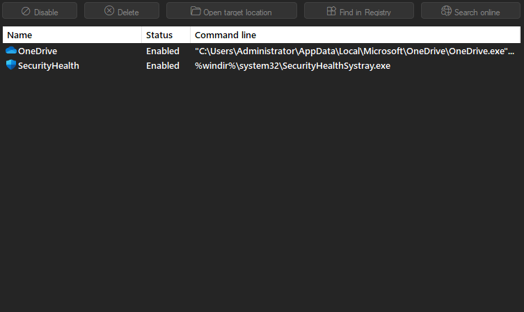
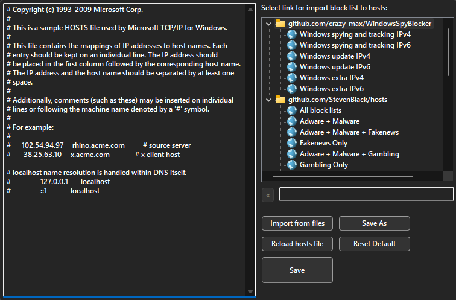

  

<h3 align=center>Tweak & optimize your Windows System</h3>
 

## Features

- System optimization

- Privacy optimization

- Explorer optimization

- Optional optimization

- Startup manager

- Host edit

- Clear StartMenu

- There are tooltips describing functions for easier use

- Save/Load optimization configuration JSON file

- Self-Capture and Save to Image

- Multiple Themes support

- Multilingual support

## Compatibility

- Windows 10 or higher
- Windows Server 2016 or higher

## Requirements

- Administrator privileges

## Command Line

- /User: Swich users

	`WinTune /User=YourUserName`
	
- /SaveConfig: Save all optimization configurations to file

	`WinTune /SaveConfig`
	
	`WinTune /SaveConfig=YourConfig.json`
	
	`WinTune /SaveConfig="d:\Path\Your Config.json"`
	
	`WinTune /User=YourUserName /SaveConfig`
	
- /LoadConfig: Load optimization configurations file

	`WinTune /LoadConfig=YourConfig.json`
	
	`WinTune /LoadConfig="d:\Path\Your Config.json"`
	
	`WinTune /User=YourUserName /LoadConfig=YourConfig.json`

## Community

- [Join discord](https://discord.gg/mk6uwQscrq)

## Translations

- Chinese (Simplified) | Jvcon
- Turkish | mikropsoft
