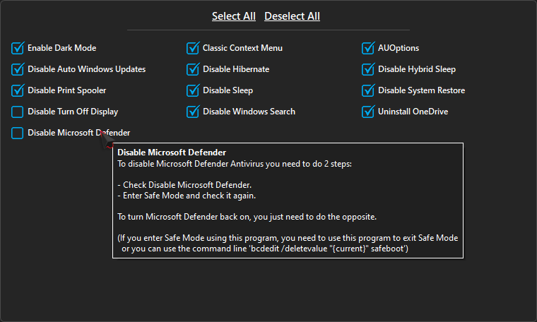

  

<h3 align=center>Tweak & optimize your Windows System</h3>
 

## Features

- System optimization:

	
- Privacy optimization:

 

- Explorer optimization:

- Optional optimization:

- Host edit

- Clear StartMenu

- There are tooltips describing functions for easier use

- Save/Load optimization configuration JSON file

- Self-Capture and Save to Image

- Multiple Themes support

- Multilingual support

## Compatibility

- Windows 10 or higher
- Windows Server 2016 or higher

## Requirements

- Administrator privileges

## Translations

- Chinese (Simplified) | Jvcon
